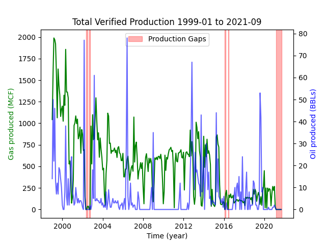

# Sample Script

This script pulls production records for four wells in Colorado directly
from the COGCC website -- specifically the wells with these API numbers
<sup>†</sup>:
* 05-001-07727
* 05-001-08288
* 05-123-08053
* 05-123-09456

<sup>†</sup> *Every well has a unique API number. These four were chosen
arbitrarily.*

It then analyzes the records for those wells for:

1. periods when there is no production in any of the wells (and *__not__*
    considering shut-in wells to be producing). 

2. periods when there is no production in any of the wells (but
    considering shut-in wells to be producing).

3. periods when there are no wells producing, but there is at least one
    well shut-in (i.e. still capable of producing, but temporarily
    "turned off".)


The script then generates
[a text report](sample analysis results/production analysis.txt)
that reads as follows (as generated on January 14, 2023):

```
A sample production analysis report.

For records for the following dates:
 >> First month: 1999-01-01
 >> Last month: 2021-09-01

Considering the following wells:
 >> 05-001-07727
 >> 05-001-08288
 >> 05-123-08053
 >> 05-123-09456

Gaps in Production (Shut-in does NOT count as production)
---- Biggest: 214 days ----
 >> 2021-03-01 : 2021-09-30
---- All those that are at least 0 days in length. ----
 >> 214 days (7 calendar months)   2021-03-01 : 2021-09-30

Gaps in Production (Shut-in DOES count as production)
---- Biggest: 0 days ----
 >> n/a
---- All those that are at least 0 days in length. ----
 >> None that meet the threshold.

Shut-In Periods
---- Biggest: 214 days ----
 >> 2021-03-01 : 2021-09-30
---- All those that are at least 0 days in length. ----
 >> 214 days (7 calendar months)   2021-03-01 : 2021-09-30
```

And finally, it generates a simple graph of total production from all
the wells examined, highlighting those periods when no wells were
producing, regardless of shut-in status (i.e. using the gaps identified
in analysis #1 above).


